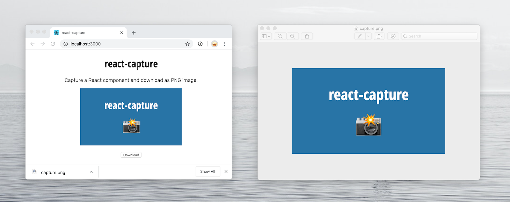

# react-capture

Capture React component and download as PNG file using [html2canvas](https://github.com/niklasvh/html2canvas).



## Install

```bash
yarn add react-capture
```

## Use

```jsx
import { useCapture } from 'react-capture'

export const Component = () => {
  const { snap } = useCapture()
  const element = useRef(null)

  const onClick = useCallback(() => {
    snap(element, { file: 'download.png' })
  }, [snap, element])

  return (
    <Wrapper>
      <ComponentWrapper ref={element}>
        <Component />
      </ComponentWrapper>

      <Button onClick={onClick} value="Download" />
    </Wrapper>
  )
}
```
